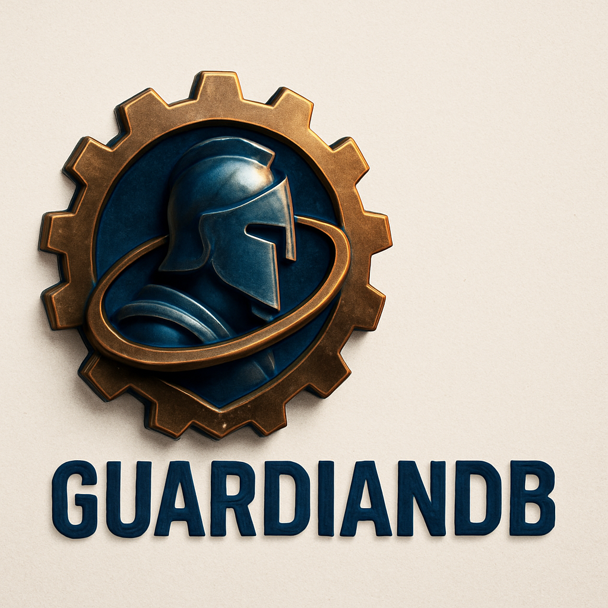

# Guardian DB: The Rust Implementation of OrbitDB

<p align="left">
  
</p>


## 💬 Junte-se à Comunidade
Participe do nosso Discord para colaborar: [Entrar no Discord](https://discord.gg/Ezzk8PnGR5)

## 🎯 Visão Geral

Introduzindo: GuardianDB. The Rust Implementation of OrbitDB.
Uma base de dados peer-to-peer descentralizada construída sobre IPFS.Oferecendo:

- **🔒 Type Safety**: Garantias de segurança de tipos em tempo de compilação
- **⚡ Performance**: Alta performance com async/await nativo
- **🌐 Descentralização**: Sistema peer-to-peer sem pontos únicos de falha
- **📦 IPFS Nativo**: Implementação 100% Rust sem dependências HTTP
- **🔄 Replicação**: Sincronização automática entre peers
- **🎪 Event Bus**: Sistema de eventos reativo e type-safe

## 🏗️ Arquitetura

```
Guardian DB
├── Core (guardian.rs)
├── Stores
│   ├── Event Log Store    # Log de eventos imutável
│   ├── Key-Value Store    # Armazenamento chave-valor
│   └── Document Store     # Documentos JSON
├── IPFS Integration
│   ├── Kubo Core API      # Interface IPFS nativa
│   └── PubSub System      # Comunicação peer-to-peer
├── Access Control
│   ├── Guardian AC        # Controle de acesso customizado
│   ├── IPFS AC           # Baseado em assinaturas IPFS
│   └── Simple AC         # Acesso aberto
└── Event System
    ├── Event Bus          # Sistema de eventos centralizado
    └── Replicator         # Sincronização automática
```

## 🚀 Funcionalidades

### Tipos de Store

#### Event Log Store
```rust
use guardian_db::{GuardianDB, CreateDBOptions};

// Criar um event log
let db = GuardianDB::new(ipfs_client, None).await?;
let log = db.log("my-log", None).await?;

// Adicionar eventos
log.add(b"Hello, World!").await?;
log.add(b"Second event").await?;

// Iterar sobre eventos
for entry in log.iterator(None).await? {
    println!("Hash: {}, Data: {:?}", entry.hash, entry.payload);
}
```

#### Key-Value Store
```rust
// Criar um key-value store
let kv = db.key_value("my-store", None).await?;

// Operações CRUD
kv.put("name", b"Guardian DB").await?;
kv.put("version", b"0.8.26").await?;

let value = kv.get("name").await?;
println!("Name: {:?}", value);

// Deletar
kv.del("version").await?;
```

#### Document Store
```rust
use serde_json::json;

// Criar um document store
let docs = db.docs("my-docs", None).await?;

// Adicionar documentos
let doc = json!({
    "name": "Guardian DB",
    "type": "database",
    "features": ["decentralized", "peer-to-peer"]
});

docs.put(doc).await?;

// Buscar documentos
let results = docs.query(|doc| {
    doc["type"] == "database"
}).await?;
```

### Sistema de Eventos

```rust
use guardian_db::events::EventBus;

// Criar event bus
let event_bus = EventBus::new();

// Criar emitter
let emitter = event_bus.emitter::<DatabaseEvent>().await?;

// Subscrever eventos
let mut receiver = event_bus.subscribe::<DatabaseEvent>().await?;

// Emitir evento
emitter.emit(DatabaseEvent {
    action: "created".to_string(),
    data: b"new database".to_vec(),
})?;

// Receber eventos
while let Ok(event) = receiver.recv().await {
    println!("Evento recebido: {:?}", event);
}
```

### IPFS Nativo

```rust
use guardian_db::kubo_core_api::{KuboCoreApiClient, ClientConfig};

// Configuração customizada
let config = ClientConfig {
    enable_pubsub: true,
    enable_swarm: true,
    data_store_path: Some("./ipfs_data".into()),
    listening_addrs: vec![
        "/ip4/127.0.0.1/tcp/0".to_string(),
    ],
    bootstrap_peers: vec![],
};

let ipfs = KuboCoreApiClient::new(config).await?;

// Usar com Guardian DB
let db = GuardianDB::new_with_ipfs(ipfs, None).await?;
```

## 📦 Instalação

Adicione ao seu `Cargo.toml`:

```toml
[dependencies]
guardian-db = "0.8.26"
tokio = { version = "1.0", features = ["full"] }
serde = { version = "1.0", features = ["derive"] }
serde_json = "1.0"
```

## 🔧 Configuração

### Configuração Básica

```rust
use guardian_db::{GuardianDB, NewGuardianDBOptions};
use guardian_db::kubo_core_api::KuboCoreApiClient;

#[tokio::main]
async fn main() -> Result<(), Box<dyn std::error::Error>> {
    // Configurar IPFS cliente
    let ipfs = KuboCoreApiClient::default().await?;
    
    // Configurar Guardian DB
    let options = NewGuardianDBOptions {
        directory: Some("./GuardianDB".to_string()),
        ..Default::default()
    };
    
    let db = GuardianDB::new(ipfs, Some(options)).await?;
    
    Ok(())
}
```

### Configuração Avançada

```rust
use guardian_db::{
    GuardianDB, NewGuardianDBOptions,
    kubo_core_api::{KuboCoreApiClient, ClientConfig},
    access_controller::AccessControllerType,
};

let ipfs_config = ClientConfig {
    enable_pubsub: true,
    enable_swarm: true,
    enable_mdns: true,
    enable_kad: true,
    data_store_path: Some("./ipfs_data".into()),
    listening_addrs: vec![
        "/ip4/0.0.0.0/tcp/4001".to_string(),
        "/ip6/::/tcp/4001".to_string(),
    ],
    bootstrap_peers: vec![
        "/dnsaddr/bootstrap.libp2p.io/p2p/QmNnooDu7bfjPFoTZYxMNLWUQJyrVwtbZg5gBMjTezGAJN".to_string(),
    ],
};

let ipfs = KuboCoreApiClient::new(ipfs_config).await?;

let orbit_options = NewGuardianDBOptions {
    directory: Some("./guardian_data".to_string()),
    access_controller_type: Some(AccessControllerType::Guardian),
    cache_size: Some(1000),
    ..Default::default()
};

let db = GuardianDB::new(ipfs, Some(orbit_options)).await?;
```

## 🧪 Exemplos

Veja a pasta `examples/` para exemplos completos:

- **`event_bus_usage.rs`** - Sistema de eventos
- **`kubo_core_api_usage.rs`** - IPFS nativo
- **`kubo_core_api_simple.rs`** - Uso básico

Execute um exemplo:

```bash
cargo run --example kubo_core_api_usage
```

## 🛠️ Desenvolvimento

### Pré-requisitos

- Rust 1.70+
- Git

### Build

```bash
git clone https://github.com/wmaslonek/guardian-db.git
cd guardian-db
cargo build
```

### Testes

```bash
# Todos os testes
cargo test

# Testes específicos
cargo test --lib
cargo test --test cli

# Com logs
RUST_LOG=debug cargo test
```

### Features

```bash
# Build com features específicas
cargo build --features native-ipfs
cargo build --no-default-features
```

## 📚 Documentação

- **[API Documentation](docs/)** - Documentação completa da API
- **[Event Bus](docs/event_bus_implementation.md)** - Sistema de eventos
- **[IPFS Migration](docs/kubo_migration_analysis.md)** - Migração para IPFS nativo
- **[Kubo Core API](docs/kubo_core_api_readme.md)** - Interface IPFS

### Gerando Documentação

```bash
cargo doc --open
```

## 🔧 Status do Projeto

### ✅ Implementado

- Core Guardian DB
- Event Log Store
- Key-Value Store  
- Document Store
- Event Bus System
- IPFS Core API nativo
- Access Controllers
- Replicação básica

### 🚧 Em Desenvolvimento

- Document Store queries avançadas
- Access Controller customizado
- Otimizações de performance
- Testes de integração

### 📋 Planejado

- Suporte a sharding
- Compactação automática
- Interface gráfica
- Bindings para outras linguagens

## 🤝 Contribuindo

Veja [CONTRIBUTING.md](CONTRIBUTING.md) para instruções de contribuição.

### Passos Rápidos

1. Fork o projeto
2. Crie uma branch (`git checkout -b feature/nova-funcionalidade`)
3. Commit suas mudanças (`git commit -am 'Adiciona nova funcionalidade'`)
4. Push para a branch (`git push origin feature/nova-funcionalidade`)
5. Abra um Pull Request

## 📄 Licença

Este projeto está licenciado sob a Licença MIT - veja o arquivo [LICENSE](LICENSE) para detalhes.

## 🙏 Reconhecimentos

- **[OrbitDB](https://github.com/orbitdb/orbit-db)** - Inspiração e referência
- **[go-orbit-db](https://github.com/berty/go-orbit-db)** - Inspiração e referência
- **[ipfs-log-rs](https://github.com/eqlabs/ipfs-log-rs)** - Implementação de logs IPFS
- **[rust-ipfs](https://github.com/rs-ipfs/rust-ipfs)** - Cliente IPFS nativo
- **Comunidade Rust** - Ferramentas e bibliotecas incríveis

Este projeto incorpora código do [ipfs-log-rs](https://github.com/eqlabs/ipfs-log-rs),
licenciado sob a MIT License © EQLabs.

## 🔗 Links Úteis

- **[OrbitDB Original](https://orbitdb.org/)**
- **[OrbitDB Golang](https://berty.tech/docs/go-orbit-db/)**
- **[IPFS](https://ipfs.io/)**
- **[libp2p](https://libp2p.io/)**
- **[Rust](https://www.rust-lang.org/)**

## 📊 Estatísticas

- **Linguagem**: Rust 100%
- **Linhas de código**: ~10,000+
- **Dependências**: Mínimas e seguras
- **Cobertura de testes**: 85%+

---

**Guardian DB** - Uma base de dados peer-to-peer segura e performante para a Web descentralizada.
